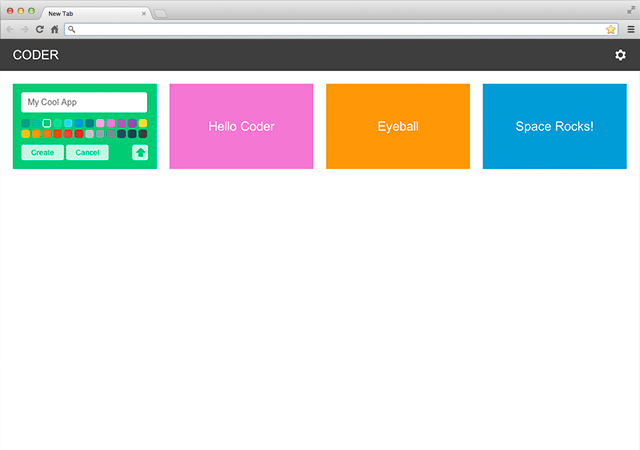

# Google Coder - HTML & CSS Scheme of Work

## Introduction

[Google Coder](http://googlecreativelab.github.io/coder/) is a free, open source project that turns a Raspberry Pi into a simple platform that educators and parents can use to teach the basics of building for the web. New coders can craft small projects in HTML, CSS and Javascript, right from the web browser.

This scheme of work will introduce students to the infrastructure of website development, in particular the concept of web pages (HTML & CSS) and web servers. It is specifically targeted towards KS2/KS3 Computing. This has been developed in harmony with the new Computing curriculum in the UK and is based on the [Google Coder Project - The Perfect Recipe](http://googlecreativelab.github.io/coder-projects/projects/perfect_recipe/).

##Learning outcomes:

Over the course of six lessons, students will learn:

- How to turn a Raspberry Pi into a webserver
- How to create webpages using HTML & CSS, in particular:
	- Different ways to display text with HTML
	- Adding images and videos
	- Adding CSS style

## Computing Programme of Study Met:

**KS2:**

- Understand computer networks, including the internet; how they can provide multiple services, such as the World Wide Web, and the opportunities they offer for communication and collaboration.
- Select, use and combine a variety of software (including internet services) on a range of digital devices to design and create a range of programs, systems and content. This will accomplish various goals including collecting, analysing, evaluating and presenting data and information.

**KS3:**

- Understand the hardware and software components that make up computer systems, and how they communicate with one another and with other systems.
- Create, reuse, revise and repurpose digital artefacts for a given audience, with attention to trustworthiness, design and usability.
- Understand a range of ways to use technology safely, respectfully, responsibly and securely, including protecting the students' online identity and privacy. Recognise inappropriate content, contact and conduct, and know how to report concerns.

[National Curriculum Computing Programmes of Study](https://www.gov.uk/government/publications/national-curriculum-in-england-computing-programmes-of-study/national-curriculum-in-england-computing-programmes-of-study#key-stage-3)

## Resources

For the majority of the lesson, it is suggested that work is carried out by students on a Raspberry Pi in pairs. Each pair should have access to the standard equipment described below, and each should have a computer with a web browser connected to the network. As there will be multiple Raspberry Pis acting as servers some setup is required in configuring them. [See multiple coder devices setup guide](https://github.com/googlecreativelab/coder/wiki/Using-Multiple-Coder-Devices-(Lab-Setup)). In addition, it is suggested that you have your own teacher setup connected to a projector screen for demonstration purposes. The checklist is below:

- A Raspberry Pi per pair connected to the local network
- An [SD card with Google Coder installed](http://googlecreativelab.github.io/coder/) per Raspberry Pi, configured to allow multiple coder devices
- A computer per student with a web browser connected to the local network

## Lessons

- [Lesson 1 - Websites & Webservers](lesson-1/lesson.md)
- [Lesson 2 - What is HTML?](lesson-2/lesson.md)
- [Lesson 3 - Adding Images and Other Media](lesson-3/lesson.md)
- [Lesson 4 - Adding Style with CSS](lesson-4/lesson.md)
- [Lesson 5 - Colour with CSS](lesson-5/lesson.md)
- [Lesson 6 - Evaluation](lesson-6/lesson.md)

## Community

Coder is open source, so everyone can help make it better. You can fix bugs, build new features and help make Coder the simplest way for new coders to learn how to create content for the web. To find out more visit the [Google Coder GitHub Page](https://github.com/googlecreativelab/coder/).

## Licence

Unless otherwise specified, everything in this repository is covered by the following licence:

***Coder HTML & CSS Lessons*** by the [Raspberry Pi Foundation](http://raspberrypi.org) is licenced under a [Creative Commons Attribution 4.0 International License](http://creativecommons.org/licenses/by-sa/4.0/).

Based on a work at https://github.com/raspberrypilearning/coder-html-css-lessons
