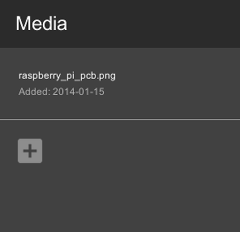
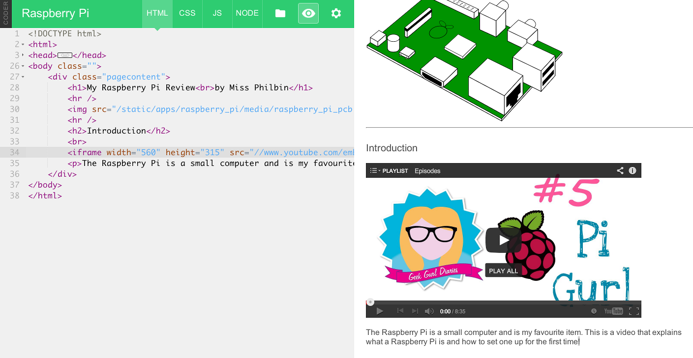

# Student Instructions - Images & Videos

## Setting up your Raspberry Pi using Google Coder

The Raspberry Pi is a bare bones computer. It’s not much use on its own. In order to use it as a webserver and create websites on it, we need to connect a number of things to it:

- An SD card. This card contains the Google Coder that can be loaded onto the Raspberry Pi in order for it to be used to create websites. You need to slide the card into the slot with the metal pins facing in towards the Raspberry Pi. The label should be visible when it is inserted.
- An ethernet cable or wifi adaptor. This will allow you to connect the Raspberry Pi to a local network to host your website projects on.
- A power adaptor. Plug the power adaptor into a socket and then the small USB connector into the Raspberry Pi. When you turn the socket switch on, you should see the Raspberry Pi flash and text should appear on the monitor.

*Note: A monitor, keyboard and mouse are not necessary, as you will connect to the Raspberry Pi from an internet browser on a different computer on the network.*

## Connect to your Raspberry Pi Coder Server

Now you have connected your Raspberry Pi to the local network you can use a computer or laptop to connect to it. You will see that after you plugged in the power cable some lights came on; this indicates that your Raspberry Pi Coder server is booting up. 

1. Give it a few minutes to boot, and then in the web browser on your computer type:

  ```
  http://coder.local/
  ```
  Don't forget the `http://` part!

2. You might have to enter the Coder number given to you by your teacher instead, for example `http://coder01.local/` or `http://coder02.local/`.  

3. Once connected, you may see a security certificate warning screen; it is OK to click the button to 'proceed anyway'. Then you will see a screen asking you to type a password. Use the password that you set up during the first lesson, for example 'raspberry'.

4. Load your project page from the last lesson by clicking on the project icon.

## Adding an Image

Currently, your webpage has some text written using different styles. You can make it more interesting by adding some pictures of the item you are reviewing.

1. Add a new line of code and a new `<hr />` tag underneath the main heading.

2. Between the two `<hr />` tags, add an `` tag. This is a tag that doesn’t need a close tag, just like `<hr />`. It should look like this: 

	```html
	<hr />
	
	<hr />
	```
	
	Notice the `src=""` part. That's an attribute of the img tag that will let you specify the image that you want to use.

3. Navigate to the top right hand side of the screen. Click on the **Media** button which looks like a folder.

4. Click the `“+”` button. You should get a prompt to upload a file. Select an image of your choice from the location it is saved on your computer.

5. Once the image is uploaded, its name and the date it was uploaded should appear. Roll over it with your mouse; you will see two buttons appear, “Paste to Code” and “Delete”.

	 

6. Go back to the HTML side, keeping the media drawer option. Position your cursor in between the two quote symbols `("")` in the `` tag we created. With the cursor still in that position, go back to the media drawer and click on the **paste to code** button. Some text that looks a little bit like a website address should appear between the quotes; that's the path to your image file. It should look something like this:

	``

7. Save your code and take a look at the preview version. Did the image appear?

8. If you added your own image, it might be too big or too small. You can shrink it down and change its size within the `` tag by adding height and width attributes. For example:

	``
	
	Try adding height and width attributes to your `` tag. See what happens when you only use either the height or width attribute. Did the image get squashed or did it stretch evenly? Play around with different measurements until you like the way it looks on the page.


## Embedding Videos

Images and text are the main focus of many websites. Nowadays, video content is becoming more important. If you have access to a video streaming site like YouTube or Vimeo, then why not embed a video on your webpage too?

1. Locate the video on a video streaming site like YouTube; once you have found one you want to use click on the **Share** button. Click on **embed** and you will see a chunk of HTML code that starts with `<iframe>`. This tag allows you to embed content like videos into webpages and blog posts.

2. Copy the code by using the keyboard shortcut **CTRL + C** and navigate back to your Coder project page.

3. Paste the code underneath a horizontal line or heading by using the keyboard shortcut **CTRL+V** Your code should look like this:

	```html
	<h1>My Raspberry Pi Review<br>by Miss Philbin</h1>
	<hr />
    
    <hr />
    <h2>Introduction</h2>
    <br>
    <iframe width="560" height="315" src="//www.youtube.com/embed/jr6IVLZmp28?list=PL455284BB15D6E8F0" frameborder="0" allowfullscreen></iframe>
    <p>The Raspberry Pi is a small computer and is my favourite item. This is a video that explains what a Raspberry Pi is and how to set one up for the first time!</p>
	```





